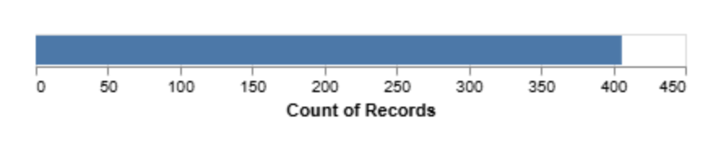

# Homework 1: Tool Setup

Holden Tatum
CS 625, Spring 2026
Due: Sunday, February 8, 2026

## Git, GitHub

### Q1 - URL of GitHub Repo

URL: https://github.com/holdentatum11/hw1-git-github-practice  
This is the URL of my personal repository where I was able to practice using Git/GitHub.  I personally only used Github.com and GitHub Desktop for this assignment.

### Q2 - Pull Command

The 'pull' command works by sending remote changes from GitHub.com browser over to the local GitHub Desktop.  The reverse would be considered the 'push' command.

### Q3 - Local Commits

I personally created text files as my files for this assignment, therefore the issues that could have happened if there was no update on GitHub.com could be either I have forgotten to save on the Notepad edit I made on the file, or I didn't click the 'push' command on GitHub Desktop.

## Markdown

### Q1 - Bulleted List

Dog Shopping List:
- Baked Chicken
- Milk-Bone Dog Treats
- Blue Buffalo Dog Food

A bulleted list is considered an 'Unordered' list.  A numbered list is considered an 'Ordered' list. You only need the dash (-) symbol in front to create a bulleted list, whereas a number list requred you to start with 1. and it will began to make each point the ascending consecutive number.  It actually doesn't matter what the numbers are after 1 in the markdown as the results will be the same.
### Q2 - Markdown Paragraph

*I have used **Markdown** before in projects I recently did last semester.* **It was the first time I did any coding and I mostly learned from using the internet and observing the `text` from my partners in my project who were experienced.**  Websites such as: https://markdownguide.offshoot.io/basic-syntax/, also help when looking for all the types of basic `syntax` for markdown. ***As I progress through this career path, I hope that all these basic `syntax` become second nature to me.***

### Q3 - Animal Image

  
This animal photo is of my dog, Dewey, after he got a haircut for halloween. I performed this by uploading a new file in the same repository as this homework assignment, copying its file path, and using the `` syntax.
## Tableau

### Q1 - Region Other Than the South

  
This is the bar chart of the Sales in the West using the Tableau Desktop Public Edition 2025.3.2.  I had to save it Tableau Public server and then download the image through the Tableau browser.

## Google Colab

### Q1 - URL of Google Colab Notebook

URL: https://colab.research.google.com/drive/1MImurwKFYp5fazMBR7qR73klKEnXGOPT?usp=sharing  
I excuted all the functions and made a few edits along the way. This include changing vairables, changing width and color for the notion of magics from Jupyter, and changing a variable from 1 to 2 in order to prevent an error.

## Python/Seaborn

### Q1 - First Penguin Image

  
This dotplot is of the Palmer Penguins dataset showing `bill_length_mm` by `bill_depth_mm`.  The dataset was loaded using pandas and the figure was created using seaborn.objects.  There doesn't appear to be any linear relationship between these two variables, but there could be possible clusters where `bill_length_mm` is medium and `bill_depth_mm` is low, and also vice versa.

### Q2 - Second Penguin Image

  
This barplot is of the Palmer Penguins dataset showing `species` by `body_mass_g`.  The dataset was loaded using pandas and the figure was created using seaborn.objects.  Here we can see that `Gentoo species` has the highest body mass of the three species shown, while both `Adelie` and `Chinstrap` are about even if not the exact same.

### Q3 - Outer Parenthesis

When you remove the outer parenthesis, this causes an `invalid syntax`.  This is due to python not recognizing that the second line is connected to the first expression.  When you use outer parenthesis, this is called an implicit line contuation, which tells python that theres more to this expression until the parenthesis is closed.

## Observable and Vega-Lite

### Q1 - markCircle to markSquare

The circle marks within the chart changed to squares.  Outside of that, there wasn't any differences.

### Q2 - markCircle to markPoint

The circle marks within the chart changed to hollow circles.

### Q3 - Swap X and Y Axes on Scatterplot

Within the code, you need to swap variable within the parenthesis for `vl.x().fieldQ("Horsepower")` and `vl.y().fieldQ("Miles_per_Gallon")` to `vl.x().fieldQ("Miles_per_Gallon")` and `vl.y().fieldQ("Horsepower")`.

### Q4 - Remove fieldN(Origin)

 
It removed the `Origin` in the y axis, causing `Europe`, `Japan`, and `USA` counts to combine into one bar. Before, we were able to see the number of car models by country, but after removing `vl.y().fieldN("Origin"),`, we could also see the total amount of car models.

## References

*Eavery report must include a References section that lists the webpages and URLs that you consulted while completing the assignment. Replace the items below with the references you consulted - these are just examples. **Everyone will use some reference to complete these assignments (even I would). You will lose points on your assignment if you do not include the references you used.***

- Graph Network using Vega-Lite or Vega, https://stackoverflow.com/questions/77096216/graph-network-using-vega-lite-or-vega
- Calculating percentage change - Math for journalists, https://observablehq.com/@nshiab/math-for-journalists
- ChatGPT: "How can I add an axis label to my line chart in Seaborn?", https://chatgpt.com/share/684c8e25-4944-8011-b265-ae9aefc07959
